# 1단계 — 기본 흐름

**범위**: 실행 파일, 곡 보관함, 소절, 녹음, 코칭(음정·박자·강약)
**완료 기준**: 비개발자가 설명서 없이 곡 추가부터 피드백 확인까지 할 수 있다.

## 한눈에

| 흐름 | 화면 |
|---|---|
| 처음 열면 이름과 동의를 한 화면에서 받고 | 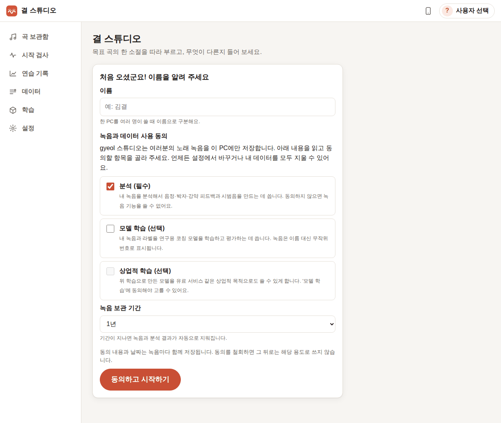 |
| 보컬 분리 모델(640MB)을 진행률과 함께 받아요 (`gyeol fetch`) | 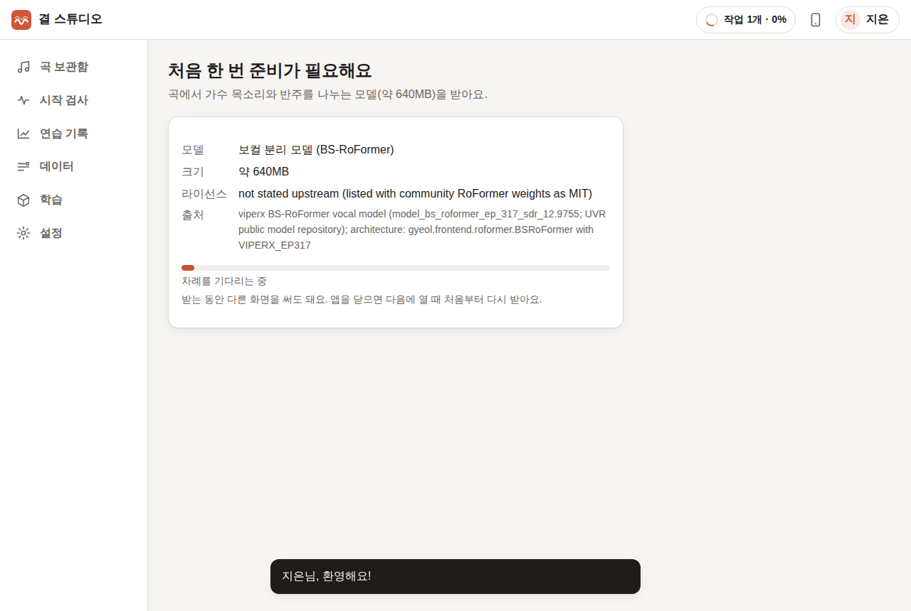 |
| 곡을 올리면 보컬·반주 분리가 백그라운드에서 돌고, 진행률과 남은 시간을 보여 줘요 (`separate_target`) | 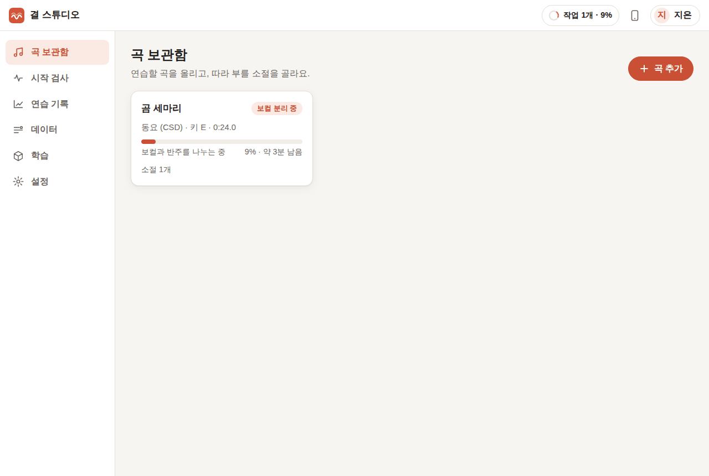 |
| 파형에서 끌어서 소절을 고르고 가사를 적어요. 분리를 기다리는 동안에도 만들 수 있어요 | 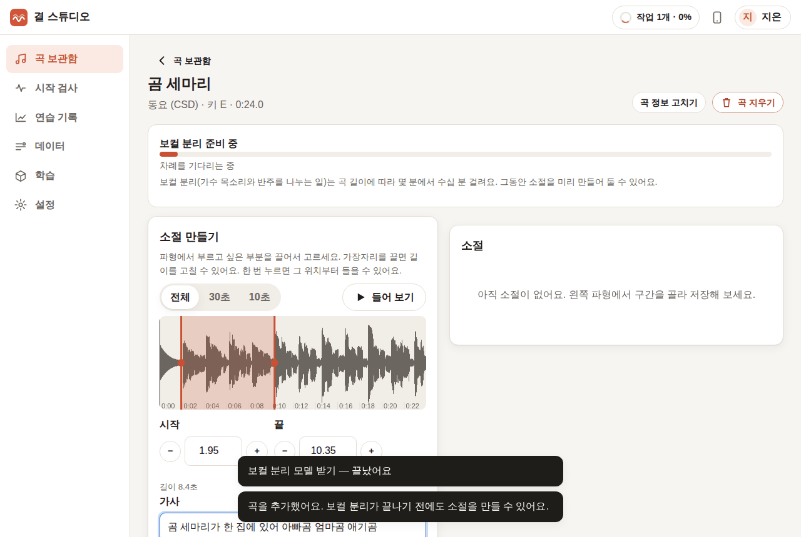 |
| 처음 녹음할 때 이어폰 안내와 지연 맞추기(탭 따라 치기 / 이어폰을 마이크에 대기) | 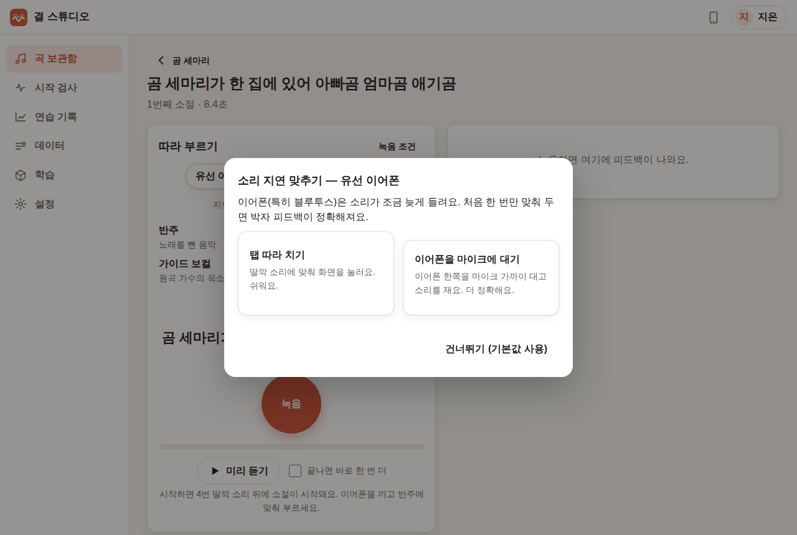 |
| 카운트인 뒤 반주·가이드 보컬에 맞춰 녹음, 가사가 지금 음절을 따라가요 | 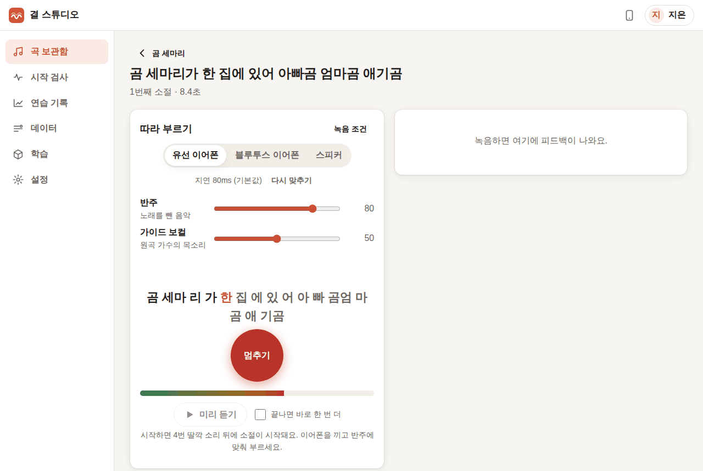 |
| 분석이 도는 동안 "무엇이 달랐다고 느끼셨나요?"를 먼저 골라요 | 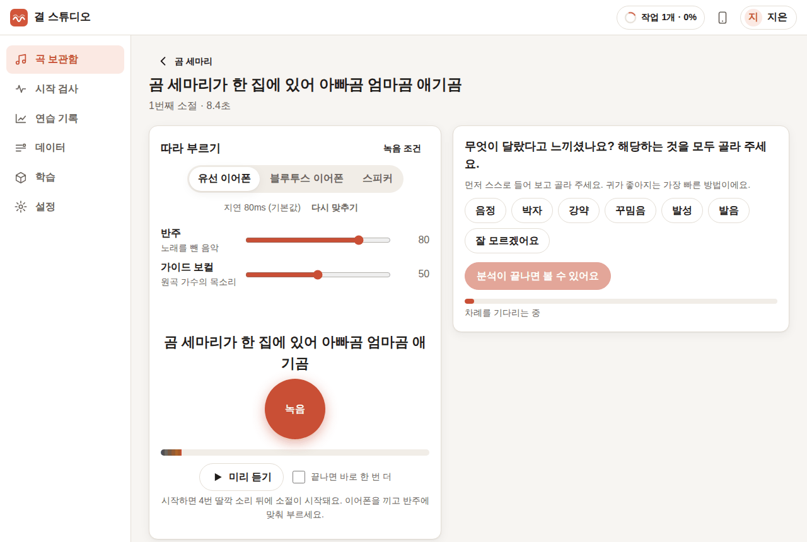 |
| 핵심 지적 1개 + 펼쳐 볼 부가 항목 최대 2개, 근거 그래프(음정 곡선 + 가사), 응답 버튼 | 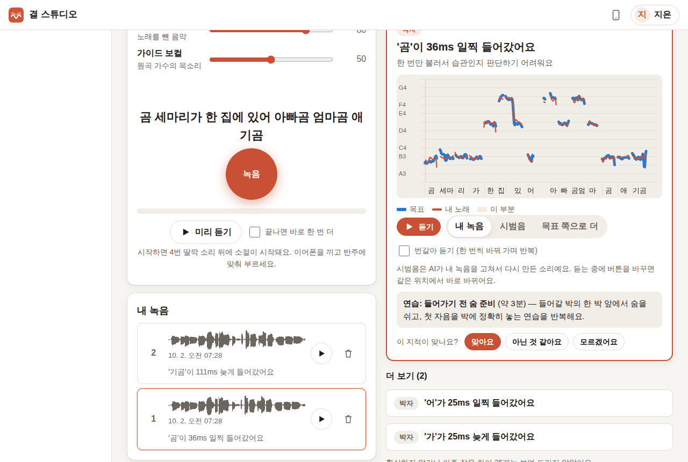 |
| 내 녹음 ↔ 내 목소리 시범음을 같은 위치에서 바꿔 들어요 (`render_demo`) | 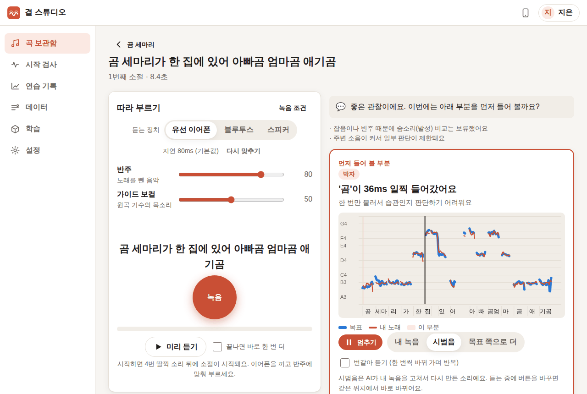 |
| 휴대폰 화면 | 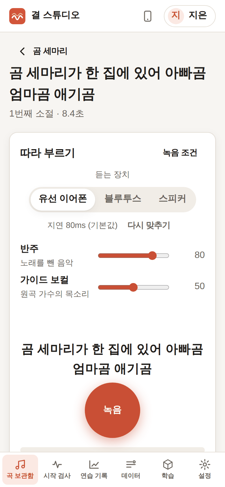 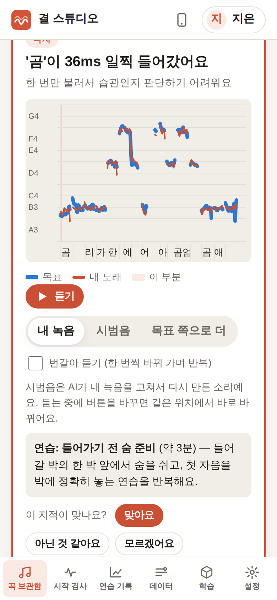 |

나머지 캡처: [screenshots/phase-1/](screenshots/phase-1/).

## 만든 것

### 실행 (`launcher.py`, `packaging/`)
- 더블클릭하면 서버를 띄우고 브라우저를 엽니다. 작은 상태 창(Tk)이 함께 뜨고, 이 창을 닫으면 앱이 꺼집니다. 이미 켜져 있으면 브라우저만 엽니다.
- 이 PC: `http://127.0.0.1:8765`(브라우저가 localhost는 안전한 주소로 보므로 마이크 사용 가능). 휴대폰: 같은 와이파이에서 `https://<PC 주소>:8766`(로컬 인증서 자동 생성, 5단계에서 다듬음).
- 실행 파일: PyInstaller 설정(`packaging/gyeol-studio.spec`) + GitHub Actions(`build.yml`)가 Windows(`gyeol-studio.exe` 폴더 zip)와 macOS(`결 스튜디오.app`, Apple 칩/인텔)를 만듭니다. 모델 가중치는 넣지 않고 첫 실행 때 받습니다.

### 오래 걸리는 작업 (`jobs.py`, `worker.py`)
- 작업은 SQLite `jobs` 표에 저장되고, 작업 프로세스 3개가 나눠 맡습니다: `fast`(분석·코칭·시범음), `slow`(모델 받기·보컬 분리), `train`(학습, 4단계). 학습이 몇 시간 돌아도 녹음 분석이 밀리지 않습니다.
- 앱을 닫았다 열면 하던 작업이 다시 큐에 들어갑니다. 작업 프로세스가 죽으면 그 작업을 "실패"로 알리고 프로세스를 다시 띄웁니다. 앱(부모 프로세스)이 꺼지면 작업 프로세스도 스스로 끝납니다(멈춘 프로세스가 남지 않는 것을 확인).
- 진행률과 남은 시간: 모델 받기는 받은 바이트로, 보컬 분리는 지난 분리에서 잰 속도로 예상합니다(라이브러리가 진행률을 주지 않음 → [요청 2](library-requests.md#2-separate_target-진행률취소)).
- 상단의 "작업 n개 · 37%" 버튼으로 모든 작업을 보고 취소할 수 있습니다.

### 곡 보관함 → 소절 (`routes/songs.py`, `tasks/songs.py`)
- 올린 파일을 바로 읽어 길이와 파형을 저장하고(못 읽으면 "MP3, WAV, FLAC, OGG로 바꿔서…"), `api.separate_target(…, cache_dir=…)`로 보컬과 반주를 나눕니다. 고급: "목소리만 있는 파일"은 분리를 건너뜁니다.
- 소절: 파형 확대(전체/30초/10초), 끌어서 고르기, 가장자리 끌어 고치기, 0.1초 단위 조절, 구간 듣기. 저장하면 분리된 보컬의 그 구간을 `api.analyze(…, separation="off", lyrics=…)`로 미리 분석합니다(목표 분석).

### 녹음 (`web/js/audio/`, `views/practice.js`)
- AudioWorklet 녹음기가 반주·가이드 보컬 재생과 **같은 오디오 시계의 같은 샘플**에서 녹음을 시작합니다. 소절 시작 위치 = 앞부분 반주 길이 + 지연 보정값으로 잘라 올립니다. 남은 몇십 ms는 gyeol이 가이드와 비교해 맞춥니다(`analyze(reference=…)`).
- 반주·가이드 보컬 볼륨을 따로 조절(재생 중에도 바로 반영), 카운트인 4번, "끝나면 바로 한 번 더"(반복 녹음), 녹음마다 파형·다시 듣기·지우기.
- 지연 맞추기: 탭 따라 치기(탭 지연 + 브라우저가 알려 주는 출력·입력 지연) 또는 이어폰을 마이크에 대고 잰 왕복 지연. 듣는 장치(유선/블루투스/스피커)마다 따로 저장됩니다.

### 코칭 (`coaching.py`, `tasks/takes.py`, `views/coachpanel.js`)
1. `api.analyze(take, reference=guide)` → `api.compare(같은 연습의 최근 녹음들, target, audibility=…)`. 여러 번 부른 녹음을 함께 넘겨서 "여러 번 같은 방향(습관)"과 "부를 때마다 다름(실수)"을 구분합니다.
2. 항목마다 표시 기준(`ThresholdSet.passes`)과 초보자 보호(`coach.health.restricted_for_level`)로 거른 뒤 `coach.priority.rank`로 정렬 → 첫 번째가 핵심, 다음 두 개가 부가 항목.
3. 근거: 내 음정 곡선과 목표 곡선(시간 맞춤 τ와 옥타브 관계를 반영)을 겹쳐 그리고, 가사 음절을 아래에 붙입니다. 해당 항목 구간을 칠하고, 마우스/손가락을 올리면 그 순간의 음과 센트 차이를 보여 줍니다. 색은 색각 이상 검사를 통과한 파랑(목표)·주황(내 노래)입니다.
4. 시범음: 핵심 항목은 분석과 함께, 부가 항목은 버튼을 누르면 `api.render_demo`로 만듭니다. "내 녹음 / 시범음 / 목표 쪽으로 더"를 같은 위치에서 끊김 없이 바꿔 듣고, "번갈아 듣기"는 한 바퀴마다 자동으로 바꿉니다. 시범음은 "AI가 내 녹음을 고쳐서 다시 만든 소리"라고 표시합니다.
5. 응답 버튼 "맞아요 / 아닌 것 같아요 / 모르겠어요"는 항목마다 저장됩니다(2단계 데이터).
6. 연습 방법 한 줄(`coach.practice`), 소리 낸 시간·피로 신호 안내(`coach.health`), 의료 진단이 아니라는 안내가 함께 나옵니다.

### 데이터 저장 (`db.py`)
- SQLite(`studio.db`) + 오디오 파일. 표: 사용자, 동의 기록, 곡, 소절, 녹음, 분석, 피드백, 응답, 시범음, 라벨, 검사, 학습 실행, 작업, 삭제 기록.
- 분석 결과는 `gyeol.api.to_json`의 JSON을 그대로 `analyses.json`에 저장하고, `schema`(`gyeol.representation` / `gyeol.explanation`)와 `version`을 열로 따로 둡니다.
- 녹음마다 소유자, 동의 범위(분석/학습/상업적 학습)와 동의 날짜, 보관 기한을 함께 저장합니다. 보관 기한이 지난 녹음은 앱이 켜져 있는 동안 6시간마다 지웁니다. 동의 문구는 데이터 폴더의 `config/consent.ko.json`에서 고칩니다.

## 실제 녹음으로 확인한 방법과 결과

**사용한 소리.** 실제 사람이 부른 한국어 동요 — CSD(Children's Song Dataset, CC BY-NC-SA 4.0)의 「곰 세마리」(kr003a). 저장소에는 넣지 않았습니다.
- 곡: 노래 앞 24초 + 음표 기록으로 만든 반주(베이스·화음·하이햇)를 섞은 파일 → 앱에 올림.
- 소절: 1.94–10.36초 "곰 세마리가 한 집에 있어 아빠곰 엄마곰 애기곰".
- 녹음: **같은 가수가 2절에서 같은 가사를 다시 부른 부분**(실제로 다른 연주), 그리고 그것을 35센트 낮춘 것.

**방법.** Chromium(Playwright)에서 앱을 처음부터 끝까지 눌러 진행했습니다(`tests/e2e/phase1.mjs`). 마이크 자리에는 "가상 가수"가 들어가 위 녹음을 녹음기 시작 프레임에 맞춰 130ms 늦게(가수·장치 지연을 흉내) 흘려 넣었고, 앱의 지연 보정은 기본값 80ms였습니다. 마이크 뒤의 녹음기, 자르기, 업로드, 분석, 코칭은 모두 실제 앱 코드입니다.

| 단계 | 결과 |
|---|---|
| 모델 받기 (640MB, sha256 확인) | 19초 |
| 보컬 분리 (24초 곡, 4코어 CPU) | 173초 |
| 목표 분석 (8.4초 소절, 음표 16개에 가사 19음절) | 3초 |
| 녹음 분석 + 비교(들리는 차이 포함) + 시범음 | 녹음마다 19–20초 |
| 남은 지연(gyeol이 가이드와 맞춘 값) | 69–111ms (신뢰도 0.96–1.00) |

| 녹음 | 핵심 지적 | 부가 항목 |
|---|---|---|
| 2절 그대로 | 박자: '곰'이 36ms 일찍 들어갔어요 | 박자 '어' 25ms 일찍, '가' 25ms 늦게 |
| 2절, 35센트 낮춤 | **음정: '세마'에서 음 흐름이 목표보다 92센트 낮게 지나가요** (여러 번 같은 방향) | 음정 '아' 51센트, '집' 53센트 낮아요 |

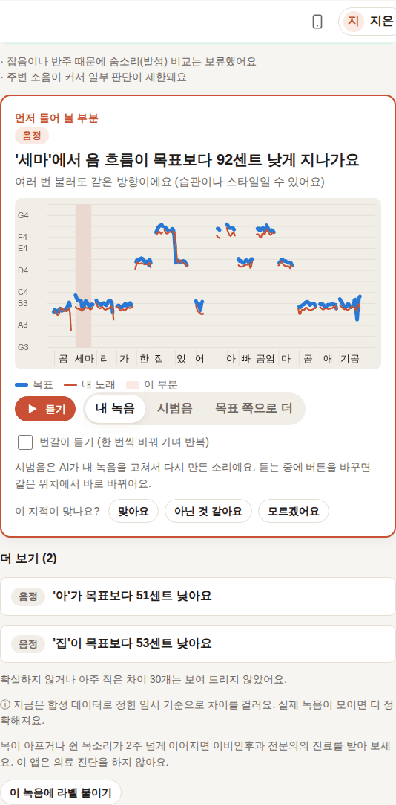

- 프로 가수의 두 연주라 차이가 작고, 핵심은 수십 ms 박자 차이였습니다. 일부러 낮춘 녹음은 음정이 핵심으로 올라왔고 "여러 번 같은 방향"으로 판단했습니다.
- (처음에는 낮춘 녹음을 리샘플링으로 만들어 2% 느려지기까지 했고, 앱은 정직하게 박자 지적을 1순위로 냈습니다. 음 높이만 바꾼 녹음으로 다시 확인한 결과가 위 표입니다.)
- 자동 테스트(`pytest`, 합성 노래): 3번째 음을 45센트 낮추고 4번째 음을 90ms 늦게 부른 녹음 → "'해'가 목표보다 45센트 낮아요"(핵심), "'요'가 95ms 늦게 들어갔어요". 실행 파일(PyInstaller, Linux 빌드)로도 같은 결과를 확인했습니다.

**아직 사람이 직접 해야 할 확인.** 이 환경에는 마이크와 사람이 없어서, 실제 이어폰을 끼고 실시간으로 따라 부르는 확인은 하지 못했습니다. 팀에서 다음을 확인해 주세요.
1. Windows / Mac에서 zip을 받아 더블클릭 → 첫 화면까지 (보안 경고 문구가 [설치 안내](설치-안내.md)와 같은지).
2. 유선 이어폰 + 노트북 마이크로 "탭 따라 치기" 후 녹음 → 박자 지적이 실제 느낌과 맞는지.
3. 블루투스 이어폰으로 "이어폰을 마이크에 대기" 보정 → 지연 값이 150–300ms 범위로 나오는지.

## 알려진 한계

- **강약 지적은 기본 화면에 나오지 않습니다.** 라이브러리에 강약 항목의 표시 기준이 없어서입니다([요청 5](library-requests.md#5-기본-표시-기준-제공과-항목-범위)). 설정 → 고급 → "검증 기준이 없는 항목도 보기(실험)"를 켜면 강약도 '참고용'으로 나옵니다. 1단계 범위의 강약은 이 상태로 둡니다.
- 표시 기준은 합성 데이터로 맞춘 임시값이며 화면에 그렇게 알립니다.
- 소절 녹음에서는 반주 새어 듦 감지를 쓰지 못합니다([요청 1](library-requests.md#1-소절-단위-목표-분리)). 이어폰이면 분리 없이, 스피커로 반주를 틀었으면 알고 있는 반주를 빼서 분석합니다.
- 가사 음절이 음표에 비례 배분이라 "엄마곰"처럼 묶이는 곳이 있습니다([요청 8](library-requests.md#8-가사-음절-정렬)).
- 보컬 분리는 CPU에서 곡 길이의 7–8배 걸립니다(4분 곡 ≈ 30분).
