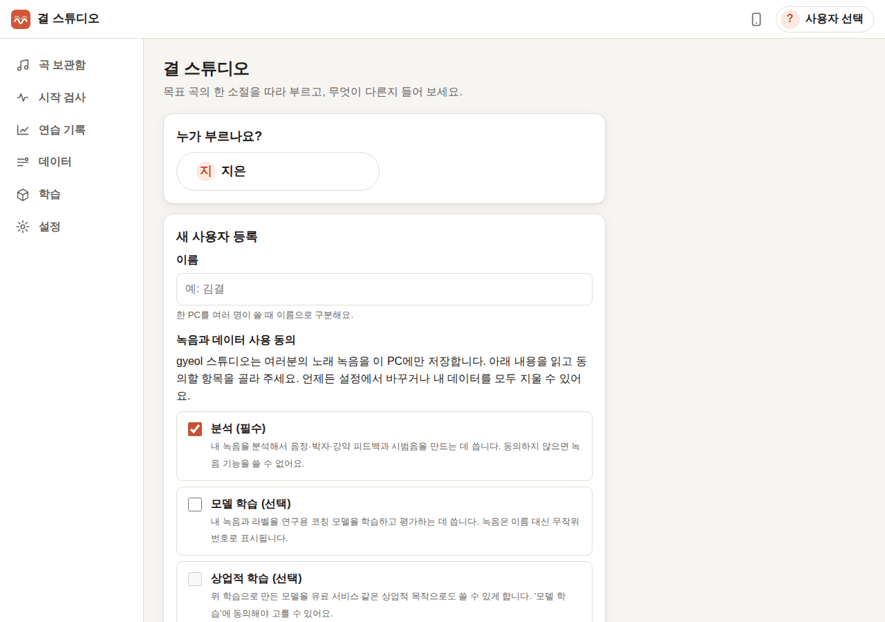
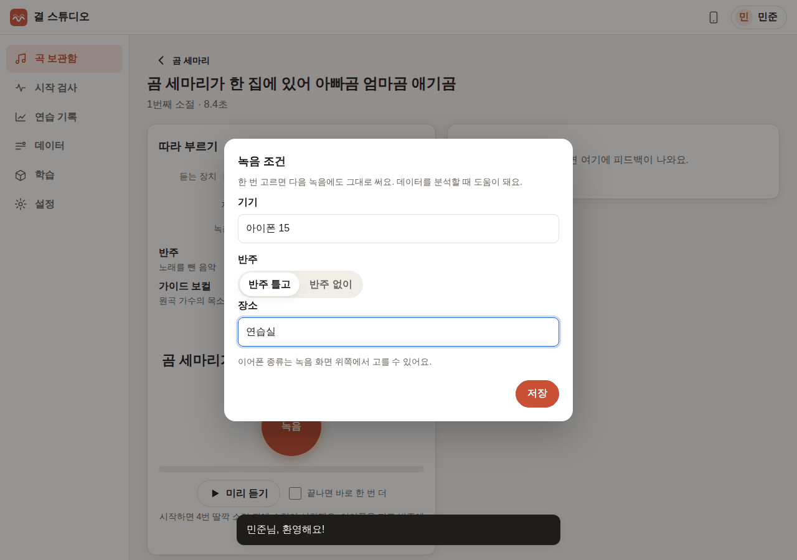
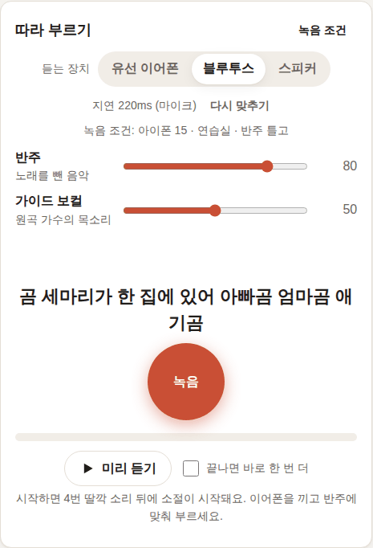
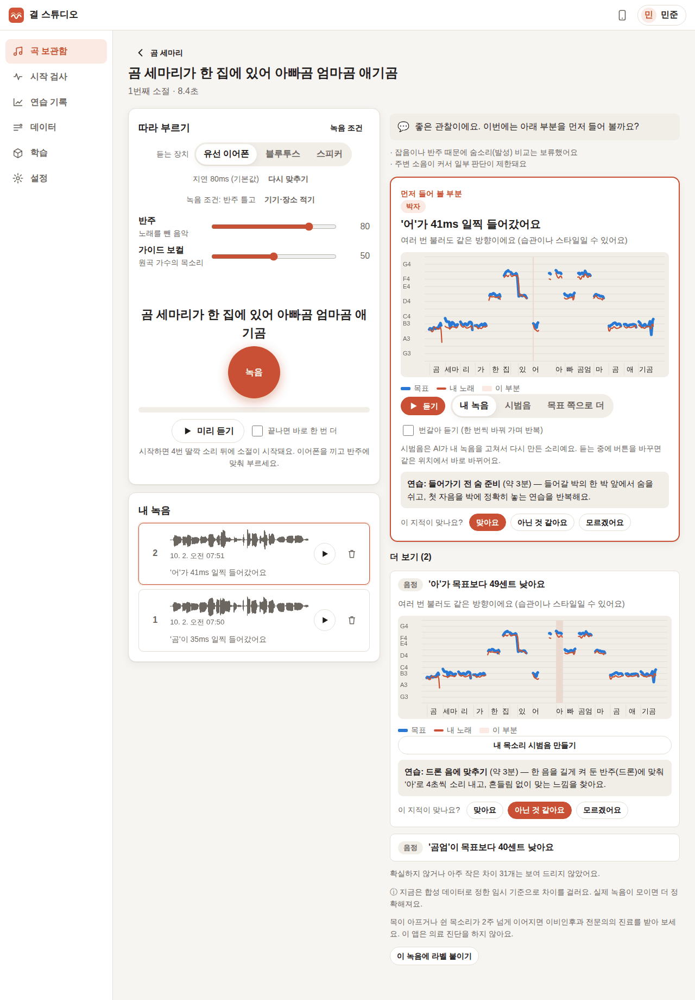
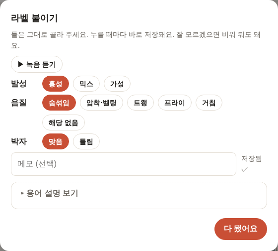
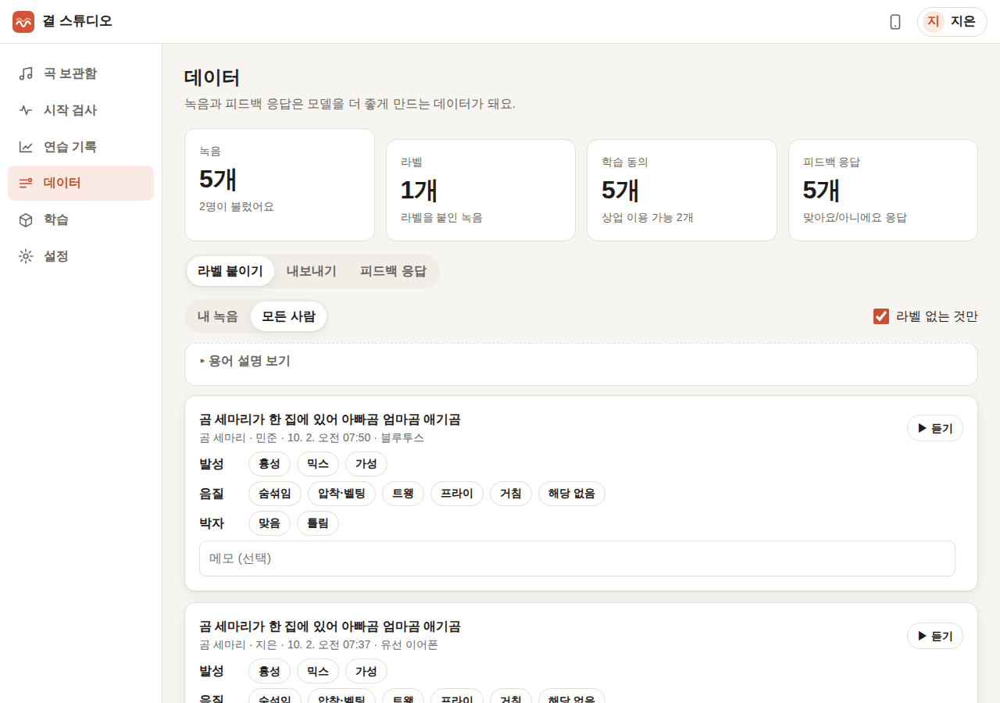
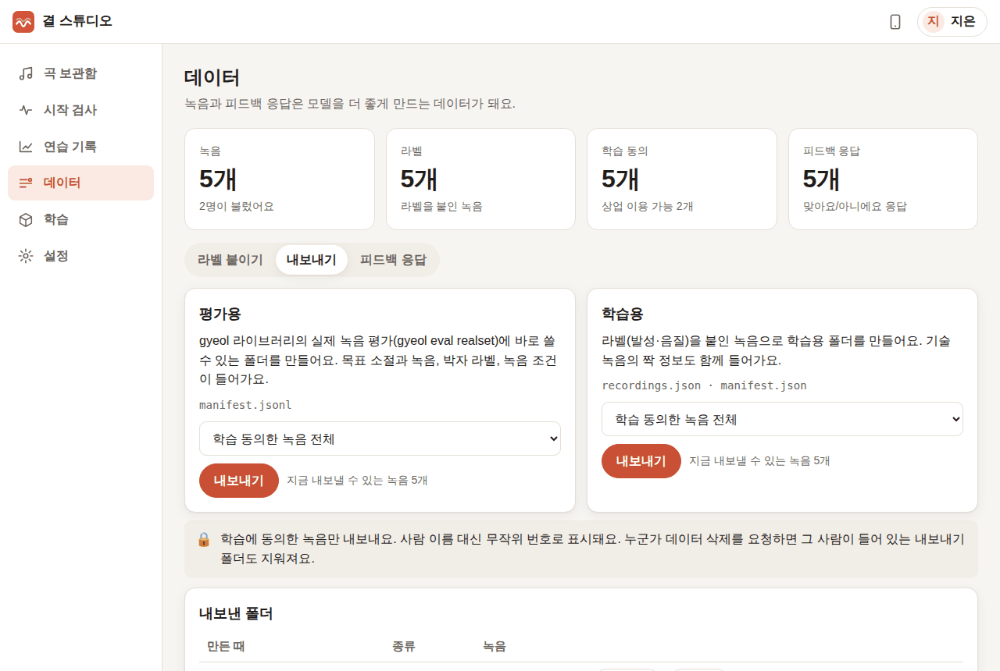
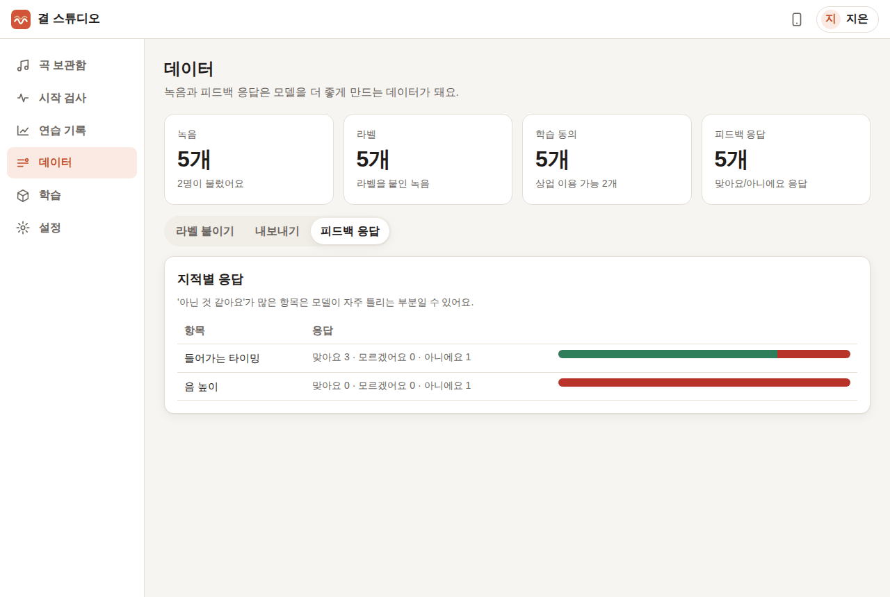
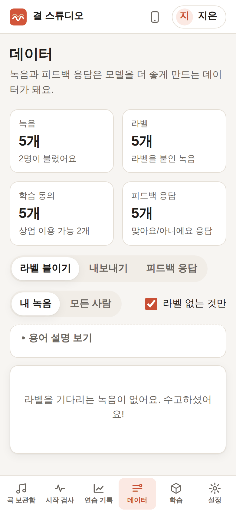

# 2단계 — 데이터

**범위**: 피드백 응답, 라벨 붙이기, 녹음 조건 기록, 내보내기

## 한눈에

| 흐름 | 화면 |
|---|---|
| 두 번째 테스터 등록(학습·상업적 학습 동의, 보관 3년) — 기존 사용자는 이름을 눌러 바로 시작 |  |
| 녹음 조건: 기기·장소·반주 유무. 한 번 고르면 다음 녹음에도 유지 |  |
| 녹음 화면에 지금 조건이 보이고, 듣는 장치(유선/블루투스/스피커)별 지연 값이 따로 저장돼요 |  |
| 지적마다 "맞아요 / 아닌 것 같아요 / 모르겠어요" (핵심·부가 항목 모두) |  |
| 코칭 화면에서 바로 라벨 붙이기 — 누를 때마다 저장 |  |
| 데이터 화면: 라벨을 기다리는 녹음을 차례로, 탭 몇 번으로 |  |
| 내보내기: 평가용(`manifest.jsonl`)과 학습용(`recordings.json`), 범위(전체 / 상업 이용 가능만) |  |
| 지적별 응답 모아 보기 |  |
| 휴대폰에서 라벨 붙이기 |  |

## 만든 것

### 피드백 응답
- 핵심 지적과 부가 항목마다 응답 버튼이 있고, 바꿔 누르면 마지막 응답으로 고칩니다(`feedback_responses`, 피드백·항목당 하나).
- 데이터 → 피드백 응답: 항목 종류(음 높이, 들어가는 타이밍 …)별로 맞아요/모르겠어요/아니에요 비율. "아니에요"가 많은 항목은 모델이 자주 틀리는 곳일 수 있다는 안내를 붙였습니다.

### 라벨 (`labels.py`, `routes/labels.py`, `views/data.js`)
- 발성: 흉성 / 믹스 / 가성 — 하나만
- 음질: 숨섞임, 압착·벨팅, 트왱, 프라이, 거침 — 여러 개, 또는 "해당 없음"(맑은 소리)
- 박자: 맞음 / 틀림, 메모
- 용어마다 한 줄 설명(칩에 마우스를 올리거나 "용어 설명 보기").
- 누를 때마다 바로 저장. 빠르게 여러 번 눌러도 순서대로 저장됩니다(확인 중 발견한 버그를 고침 — 아래).
- 데이터 화면에서 "내 녹음 / 모든 사람", "라벨 없는 것만"으로 거르고, 코칭 화면의 "이 녹음에 라벨 붙이기"로도 엽니다.

gyeol 학습 어휘로 바꾸는 규칙(`labels.to_gyeol`):

| 앱 라벨 | 내보낼 때 |
|---|---|
| 흉성 / 믹스 / 가성 | `register: chest / mixed / falsetto` |
| 음질 하나 | `phonation: breathy / pressed_belt / pharyngeal_twang / fry / rough` |
| 음질 "해당 없음" | `phonation: null` (모든 음질의 음성 예제) |
| 음질 둘 이상 | `phonation` 없음, `qualities: [...]` (라이브러리가 하나만 받음 → [요청 7](library-requests.md#7-녹음-하나에-음질-라벨-여러-개)) |
| 박자 맞음 / 틀림 | 평가용 `annotations.rhythm_ok`, 학습용 `labels.rhythm_ok` |

### 녹음 조건
- 기기, 이어폰 종류(유선/블루투스/스피커), 반주 유무, 장소. 브라우저에 기억해 두고 다음 녹음에도 그대로 씁니다. 녹음마다 `takes.conditions`에 저장됩니다.
- 스피커 + 반주 틀고 녹음하면 분석할 때 알고 있는 반주를 빼고(`analyze(backing=…)`), 평가용 내보내기에서 `condition: mixture_phone`이 됩니다. 나머지는 `clean`.

### 내보내기 (`exporting.py`, `tasks/export.py`, `routes/exports.py`)
- **학습에 동의한 녹음만** 내보냅니다. "상업 이용 가능한 데이터만"을 고르면 상업적 학습에도 동의한 녹음만. 동의를 나중에 철회하면 그 뒤 내보내기에서 빠집니다.
- 사람은 이름 대신 무작위 번호(사용자 id)로만 나옵니다. 폴더마다 `README.txt`(범위, 개수, 주의)와 `export.json`(누가 들어 있는지)을 씁니다.
- 누군가 데이터 삭제를 요청하면 그 사람이 들어 있는 내보내기 폴더도 함께 지웁니다.
- PC에서는 "폴더 열기", 어디서든 "zip 받기".

평가용 `manifest.jsonl` 한 줄(실제 내보낸 파일에서):

```json
{"id": "38f75ed5481f41d0", "audio": "audio/users/38f75ed5481f41d0.wav", "role": "user", "target": "2f04f4dd788549b2",
 "singer": "0d057d7a74e84a7b", "session": "4800ffa411e74372", "condition": "clean",
 "lyrics": "곰 세마리가 한 집에 있어 아빠곰 엄마곰 애기곰", "annotations": {"rhythm_ok": true},
 "recording": {"route": "wired", "backing": "backing/2f04f4dd788549b2.wav"},
 "studio": {"labels": {"register": "chest", "phonation": "pressed_belt", "rhythm_ok": true}, "latency_ms": 80.0, …}}
```

학습용 `recordings.json` 한 항목:

```json
{"path": "audio/38f75ed5481f41d0.wav", "user_id": "0d057d7a74e84a7b",
 "labels": {"register": "chest", "phonation": "pressed_belt", "rhythm_ok": true}, "session": "4800ffa411e74372"}
```

함께 쓰는 `manifest.json`(`dataset: own_recordings`)은 `gyeol prepare --manifest`와 학습(4단계)에 바로 씁니다.

## 실제 녹음으로 확인한 방법과 결과

1단계와 같은 실제 노래(CSD 「곰 세마리」)와 가상 가수로 Chromium에서 진행했습니다(`tests/e2e/phase2.mjs`).
- 새 테스터 "민준"이 블루투스(지연 220ms) + "아이폰 15 · 연습실 · 반주 틀고" 조건으로 2번 녹음, 응답 버튼을 누르고 코칭 화면에서 라벨을 붙임.
- "지은"이 데이터 화면에서 모든 사람의 녹음 4개에 라벨을 붙이고 두 가지를 내보냄.

**내보낸 파일을 gyeol로 읽어 보기.**
- 자동 테스트(`tests/test_data.py`)가 내보낸 폴더를 라이브러리 자신의 로더로 읽습니다: `gyeol.eval.realset.load_realset`(평가용), `gyeol.data.adapters.scan_own`(recordings.json), `gyeol.data.manifest.open_manifest`(manifest.json). 학습 동의가 없는 사람이 빠지는지, 상업 범위에서 한 명만 남는지, 사람 삭제 때 폴더가 지워지는지도 확인합니다.
- 브라우저로 내보낸 평가용 폴더에 라이브러리 CLI를 그대로 실행했습니다.

```
$ gyeol eval realset exports/20261002-075147-eval --dsp-only --separation off
condition    n  octave_decided  octave_withheld  octave_errors  false_rhythm_verdicts  withheld_rate
clean        5               5                0              0                     59          0.225
```

녹음 5개 모두 옥타브 관계를 판단했고 틀린 것은 없었습니다. "박자 맞음" 라벨이 붙은 녹음에서 50ms 이상 박자 지적이 59번 나왔습니다. 이 테스트의 박자 라벨은 스크립트가 정해 둔 값이라 숫자 자체에 의미는 없고, **팀이 실제로 들어 보고 붙인 박자 라벨이 쌓이면 이 표가 박자 판단 기준이 너무 민감한지 알려 준다**는 점이 중요합니다.

**확인 중 발견해서 고친 문제.**
1. 데이터 화면이 열리지 않음 — 응답 집계 쿼리가 없는 열(`f.item_key`)을 읽었습니다. 테스트가 "차이가 없는 녹음"으로 이 경로를 건너뛰고 있어서 놓쳤고, 차이가 있는 녹음으로 항상 확인하게 테스트를 고쳤습니다.
2. 라벨 칩을 빠르게 여러 번 누르면 일부가 사라짐 — 먼저 보낸 저장의 응답이 늦게 와서 나중에 누른 값을 덮었습니다. 화면 상태를 기준으로 두고 저장을 순서대로 보내게 고쳤습니다.
3. 피드백을 연 직후 화면이 한 번 다시 그려짐(재생 중이던 시범음이 멈출 수 있었음) — 고쳤습니다.

## 알려진 한계
- 녹음 조건의 기기·장소는 자유 입력이라 표기가 섞일 수 있습니다("아이폰15", "iPhone 15"). 데이터가 쌓이면 자주 쓰는 값을 고르게 바꾸는 것이 좋겠습니다.
- 라벨은 누가 붙였는지(`labeled_by`)만 남기고 여러 사람의 라벨을 따로 모으지는 않습니다(마지막 라벨이 남음). 라벨 일치도를 재려면 사람별 라벨 표가 필요합니다.
