# 3단계 — 관리

**범위**: 시작 검사, 연습 기록, 사용자 프로필

## 한눈에

| 흐름 | 화면 |
|---|---|
| 시작 검사 안내 — 무엇을 몇 번 하는지 먼저 알려 줘요 | 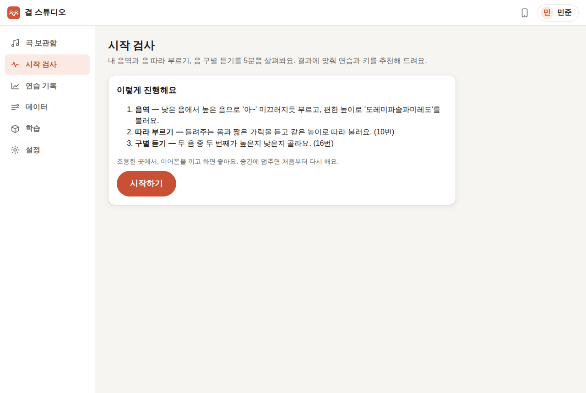 |
| ① 음역: 미끄러지듯 올라가기·내려가기, 편한 높이로 도레미파솔파미레도 | 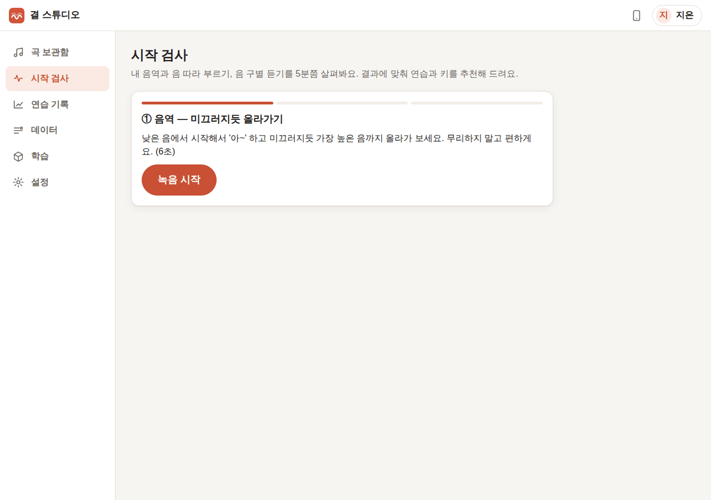 |
| ② 따라 부르기: 음 하나(6번), 두 음(3번), 짧은 가락(1번) | 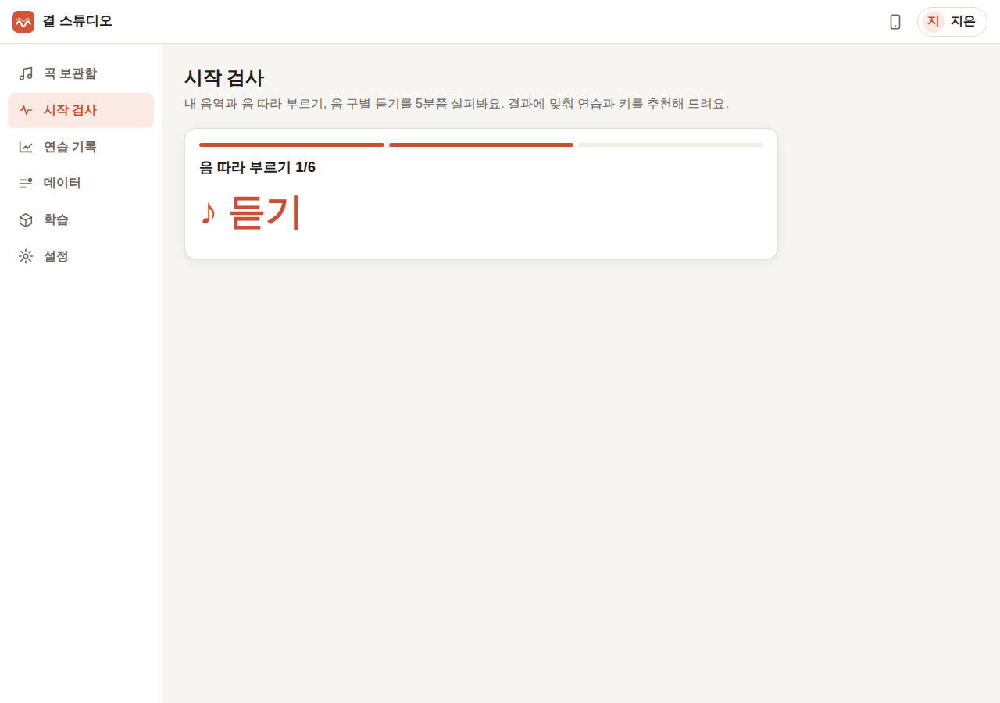 |
| ③ 구별 듣기: 두 번째 음이 높았는지 낮았는지 (16번, 다시 듣기 가능) | 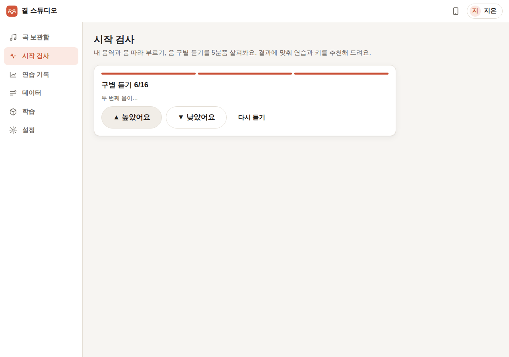 |
| 결과를 쉬운 말로 — 편한 음역 막대, 따라 부르기·일정함·듣기, 추천 연습 | 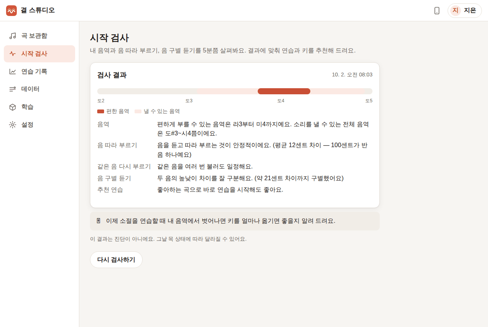 |
| 소절이 음역을 벗어나면 연습 화면 위에 키 조정 안내 | 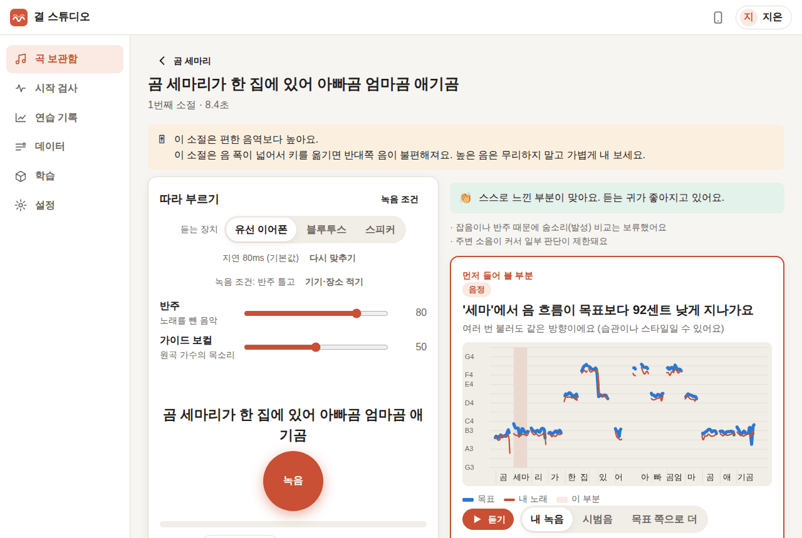 |
| 연습 기록: 오늘의 목 상태, 하루 노래한 시간(권장 상한선), 소절별 변화 | 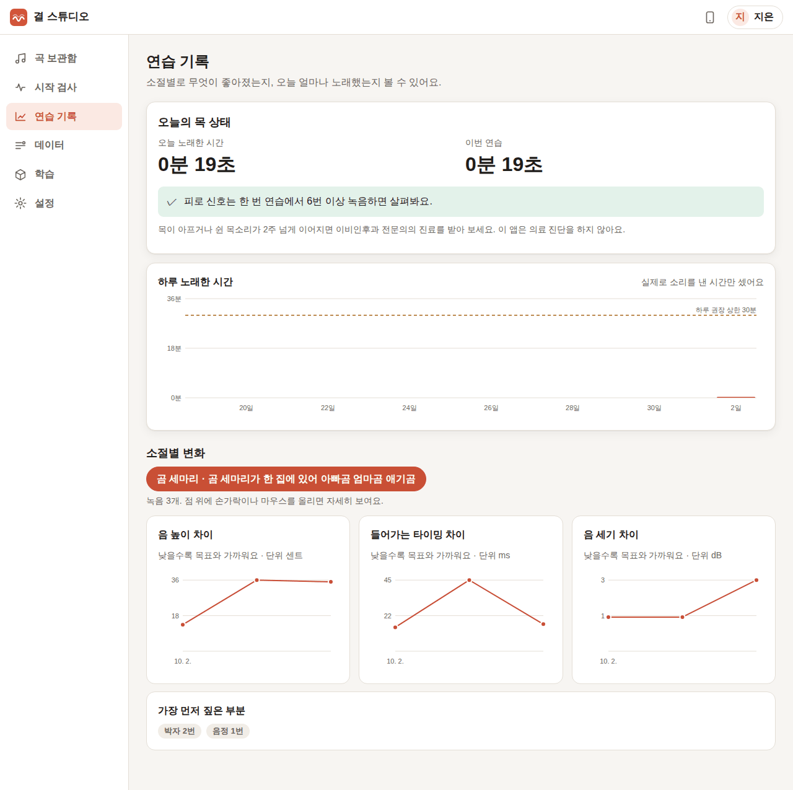 |
| 휴대폰 화면 | 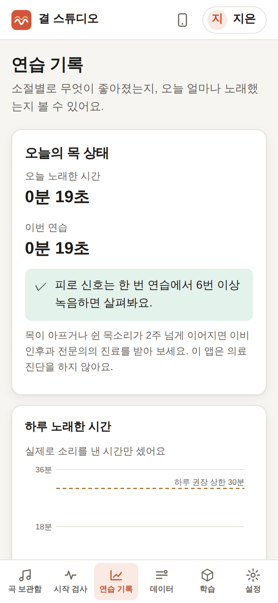 |
| 이름으로 사용자 바꾸기 | 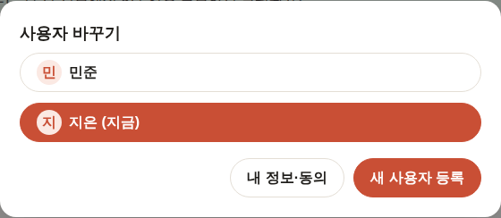 |
| 내 정보·노래 경험·동의 고치기, 내 데이터 모두 지우기(이름을 다시 입력해 확인) | 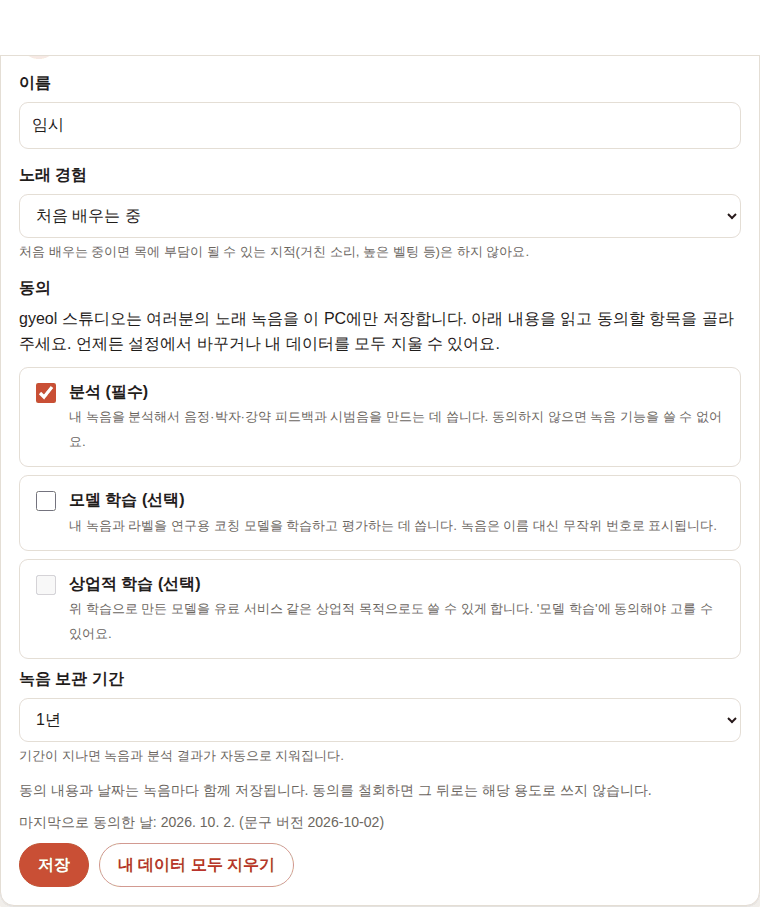 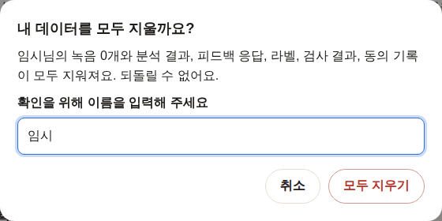 |

## 만든 것

### 시작 검사 (`checks.py`, `routes/checks.py`, `tasks/checks.py`, `views/check.js`)
- 브라우저가 자극음(삼각파 + 배음)을 들려주고 시도마다 따로 녹음해 올립니다. "편한 높이" 녹음은 올리자마자 음 높이를 재서, 이후 따라 부르기 음을 **그 사람의 목소리 높이**에 맞춥니다(남녀 차이로 한 옥타브 다르게 불러도 맞게 채점 — `fold_octave`).
- 끝나면 작업 프로세스가 녹음마다 `gyeol.api.analyze`로 음 높이를 재고, `gyeol.coach.onboarding.score_onboarding`(따라 부르기 정확도·일정함·구별 듣기 문턱, 연습 경로)과 `VoiceRange.from_samples`(전체 음역 2–98 백분위, 편한 음역 10–90 백분위)로 채점합니다. 녹음마다의 분석 JSON(`gyeol.representation`)도 저장합니다.
- 결과 문구는 앱 문구 파일(`strings.ko.json`)에서 옵니다. 사람에게 붙는 꼬리표는 쓰지 않고("음치" 등 금지 — 테스트로 확인), "진단이 아니에요"를 함께 씁니다.
- 편한 음역은 사용자 정보(`users.voice_range`)에 저장되어 코칭(초보자 보호 규칙의 높은 흉성 판단)과 키 조정 안내에 쓰입니다.

### 키 조정 안내 (`/api/phrases/{id}/range-check`)
- 소절의 음 높이(목표 분석의 음표 중심)를 `coach.health.check_phrase`로 내 음역과 비교해 "편한 음역보다 높아요", "키를 아래로 2반음 옮겨 부르는 것을 추천해요", "편한 옥타브로 옮겨도 괜찮아요"를 보여 줍니다.
- 라이브러리가 더 나은 키를 찾지 못한 경우(소절의 음 폭이 편한 음역보다 넓음)에는 "키를 옮기면 반대쪽 음이 불편해져요. 높은 음은 무리하지 말고 가볍게"라고 이유를 붙였습니다. 실제 동요 소절(음 폭 7.5반음, 편한 음역 6.8반음)에서 이 경우가 나왔습니다.
- 시작 검사를 안 했으면 "시작 검사를 하면 알려 드려요" 링크를 보여 줍니다.

### 연습 기록 (`routes/history.py`, `views/history.js`)
- **오늘의 목 상태**: 오늘 / 이번 연습에서 실제로 소리를 낸 시간(`coach.voiced_seconds`의 합), 피로 신호(`coach.fatigue_flags` — 한 연습에서 6번 이상 녹음하면 판단), 쉬는 시간 권고(`coach.phonation_warnings`: 한 연습 10분, 하루 30분 기본값).
- **하루 노래한 시간**: 최근 14일 막대그래프 + 하루 권장 상한선.
- **소절별 변화**: 음 높이 차이(센트)·들어가는 타이밍 차이(ms)·음 세기 차이(dB)를 각각 따로 그린 작은 그래프 3개(두 척도를 한 그래프에 섞지 않음), 점마다 날짜와 그때 먼저 짚은 부분을 보여 주는 툴팁, 가장 자주 먼저 짚은 부분.
- 그래프는 실제 폭에 맞춰 다시 그려서 PC와 휴대폰에서 글자 크기가 같습니다.

### 사용자 프로필
- 이름만으로 등록·전환(상단 이름 버튼). 같은 이름은 막습니다. 여러 명이 한 PC를 쓰고, 휴대폰에서도 같은 목록에서 고릅니다.
- 내 정보: 이름, 노래 경험(초보자면 목에 부담되는 지적을 하지 않음), 동의 변경(이력 저장, 학습 동의를 끄면 이전 녹음도 학습에서 빠짐), 보관 기간.
- **내 데이터 모두 지우기**: 녹음·분석·피드백 응답·라벨·검사·동의 기록과 그 사람이 들어 있는 내보내기 폴더를 지우고, 이름 없는 삭제 기록(무작위 id, 시각, 개수)만 남깁니다.

## 실제 녹음으로 확인한 방법과 결과

**시작 검사.** 이 과제들(미끄러지듯 부르기, 들려준 음 따라 부르기)을 실제 사람이 부른 공개 녹음은 없어서, Chromium 안의 가상 가수가 **앱이 실제로 들려준 음을 듣고 따라 부르도록** 했습니다(`singer.js`의 echo 모드). 가상 가수의 목소리는 gyeol의 합성 가창(`gyeol.synth`)이고, 들은 음보다 18센트 높게(25센트 단위로 반올림) 부르며, 구별 듣기는 20센트 이상 차이만 맞히고 그 아래는 무작위로 고릅니다.

| 항목 | 가상 가수의 실제 행동 | 앱의 결과 |
|---|---|---|
| 음역 | C3→C5로 반음씩 올라가기·내려가기, 도레미파솔파미레도를 A3–E4에서 | 전체 C#3–B4, 편한 음역 A3–E4 |
| 음 따라 부르기 | 들은 음보다 약 +20~25센트 | 평균 12센트 차이(음 하나 25센트, 두 음·가락은 음 사이 간격이라 0에 가까움), "안정적이에요" |
| 같은 음 다시 부르기 | 매번 같은 오차 | "일정해요"(합성음이라 실제 사람보다 지나치게 일정함) |
| 구별 듣기 | 20센트 이상만 정답 | 문턱 약 21센트, "잘 구분해요" |
| 채점 시간 | 녹음 13개 | 5–7초 |

결과가 가상 가수가 실제로 한 행동과 맞게 나왔습니다. 사람의 목소리로는 팀에서 확인이 필요합니다(아래).

**연습 기록과 키 조정.** 1·2단계의 실제 동요 녹음(CSD 「곰 세마리」) 기록으로 그래프와 안내를 확인했습니다. 위 검사 결과(편한 음역 A3–E4)와 이 소절(A#3–F#4)을 비교해 "편한 음역보다 높아요"와 음 폭 설명이 나왔습니다.

**자동 테스트**(`tests/test_manage.py`): 합성 가창으로 검사 13개 녹음 → 정확도·일정함·음역 결과, 분석 JSON 13개 저장, 음역 밖 소절의 키 안내, 연습 기록·목 상태 계산, 프로필 이름 중복·동의 규칙(학습 없이 상업적 학습 불가)·동의 이력.

**확인 중 발견해서 고친 문제.**
1. **확인 창의 "지우기"가 아무것도 하지 않음** — 1단계부터 있던 버그입니다. 확인 창이 닫히면서 "취소"로 먼저 처리되어 곡·소절·녹음 지우기와 내 데이터 지우기가 실행되지 않았습니다. 확인을 먼저 처리하도록 고쳤고, 화면에서 실제로 지워지는 것까지 확인했습니다.
2. 음역 막대 끝의 음 이름이 줄바꿈되던 문제, 연습 기록 그래프 글자 크기가 화면 폭에 따라 달라지던 문제.

**사람이 직접 해야 할 확인.**
1. 실제 목소리로 시작 검사를 끝까지 해 보고, 음역 결과가 본인이 아는 음역과 비슷한지.
2. 남성 테스터가 여성 음역 근처의 자극음을 한 옥타브 낮게 따라 불렀을 때 "따라 부르기" 결과가 나빠지지 않는지(옥타브 접기 확인).
3. 휴대폰 스피커로 검사할 때 자극음이 마이크로 다시 들어가지 않는지(이어폰 권장 문구가 충분한지).

## 알려진 한계
- 피로 신호는 한 연습에서 녹음 6번 이상부터 판단합니다(라이브러리 기본값). 소리를 낸 시간 권고 기준(10분/30분)은 라이브러리의 임시 기본값이며 언어치료사 검토 전입니다.
- 시작 검사는 중간에 멈추면 처음부터 다시 합니다.
- 연습 기록의 음 세기(dB) 그래프는 표시 기준이 없는 항목도 포함한 원시 측정값의 평균입니다(코칭 화면에는 기준이 없어 나오지 않음).
