# 4단계 — 학습

**범위**: 기술 녹음 모드, 학습 관리 화면(시작·멈춤·이어서, 비교·적용·되돌리기, 데이터 범위, 출처)

## 한눈에

| 흐름 | 화면 |
|---|---|
| 연습 화면의 **기술 녹음**: 녹음할 차이를 고르면 두 번 부를 방법을 순서대로 보여 줘요 | 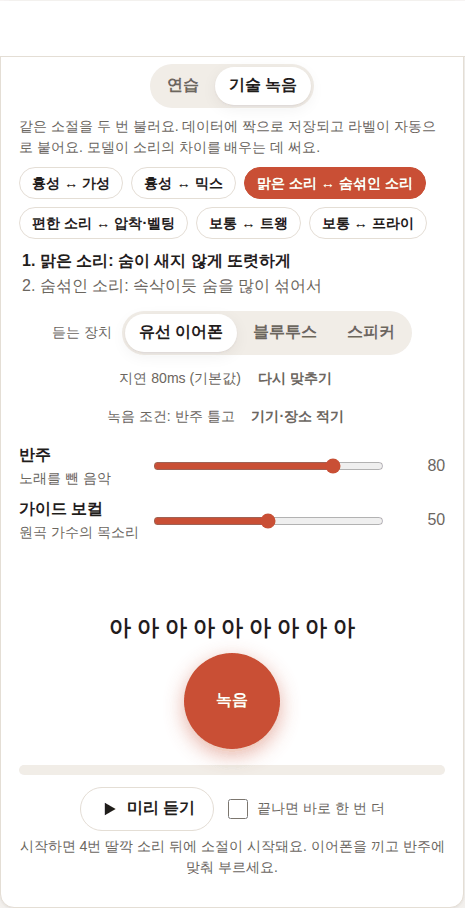 |
| 첫 번째(맑은 소리)를 저장하면 ✓ 표시와 함께 두 번째(숨섞인 소리) 차례로 넘어가요 | 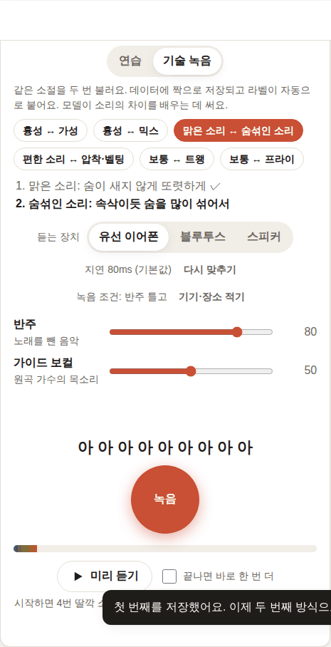 |
| 짝으로 저장되고 라벨이 자동으로 붙어요 (내 녹음 목록의 "기술: …" 표시) | 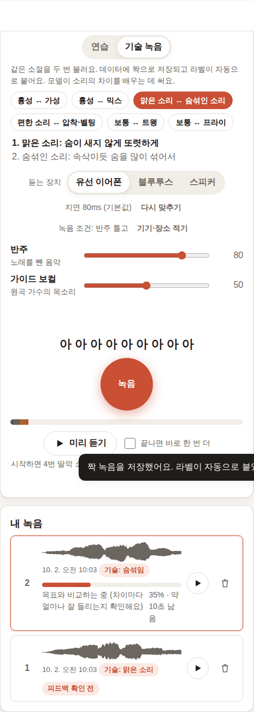 |
| 학습 화면: 쓸 수 있는 녹음·사람 수, 데이터 범위(전체 / 상업 이용 가능만), 방식(빠르게 / 꼼꼼하게) | 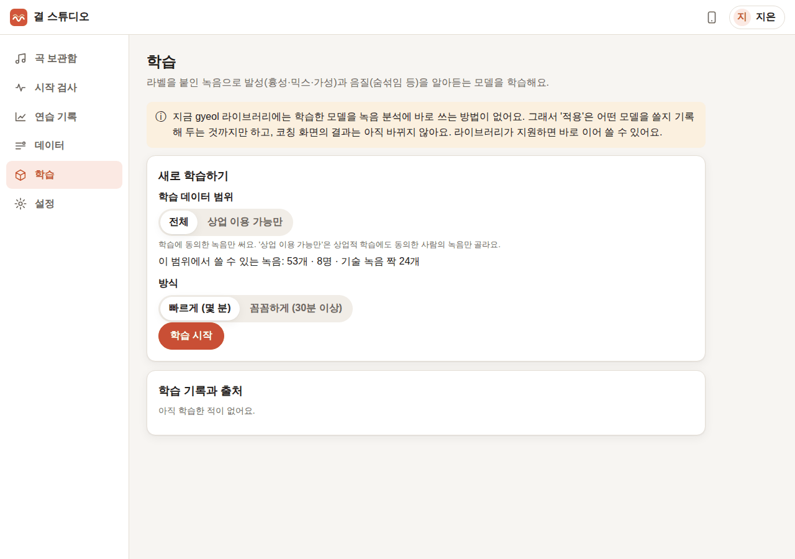 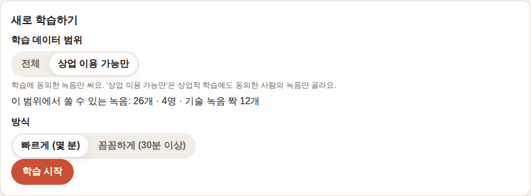 |
| 진행: 준비 → 학습(단계, 남은 시간), 최근 검증 점수, 검증 손실 그래프 | 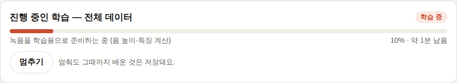 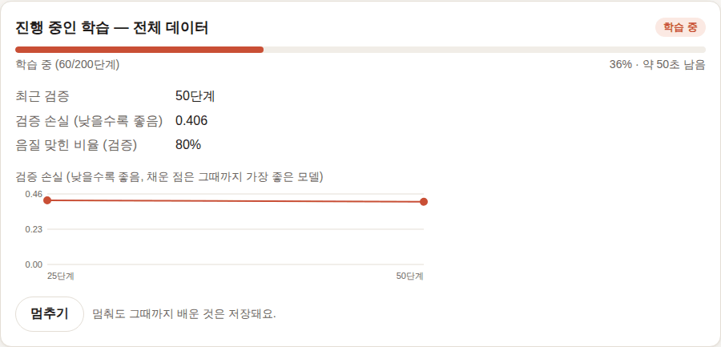 |
| 멈추기 → "…단계에서 멈췄어요" → 이어서 학습 | 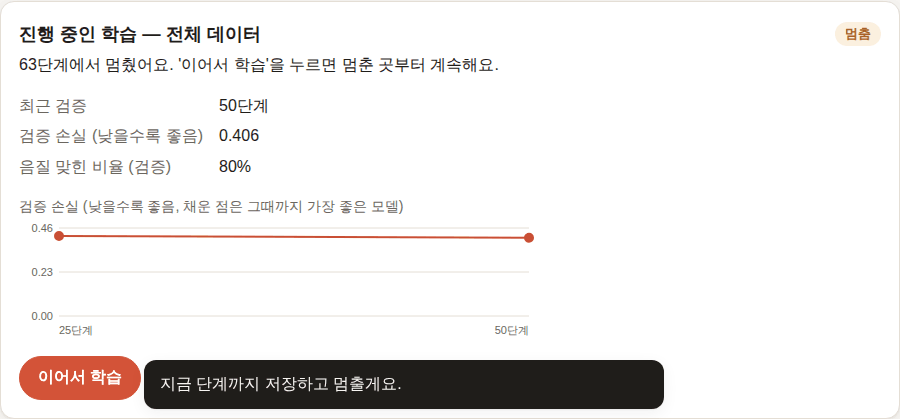 |
| 새 모델과 지금 모델 비교, 적용 | 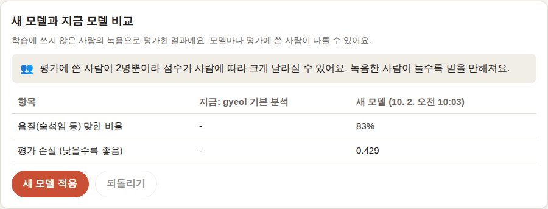 |
| 두 번째 학습(상업 이용 가능만)과 적용된 모델 비교, 학습 기록마다 데이터·라벨·출처·동의 범위 | 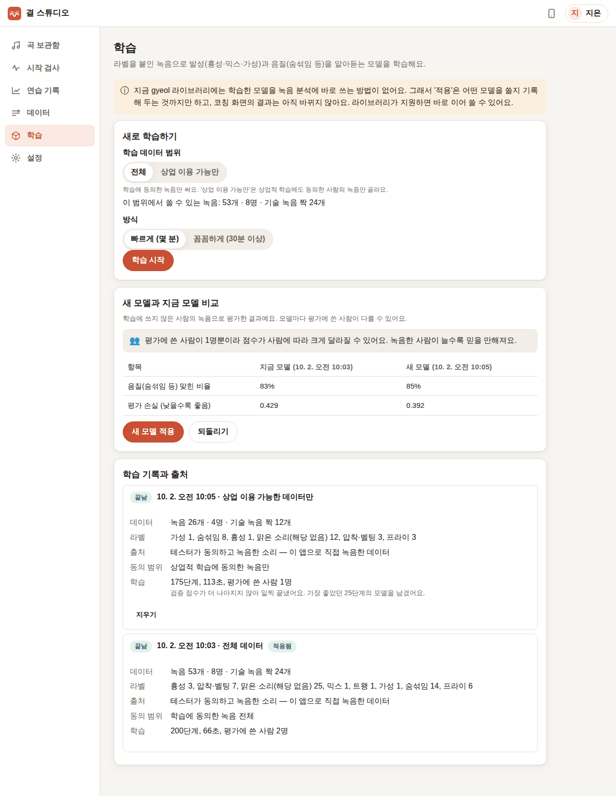 |
| 되돌리기 → gyeol 기본 분석 | 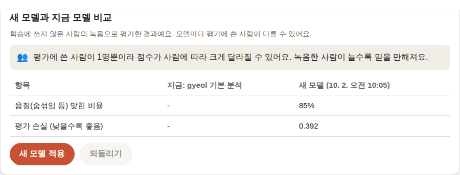 |
| 휴대폰 화면 | 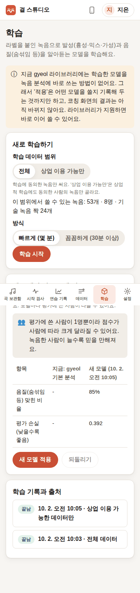 |

## 만든 것

### 기술 녹음 모드 (`views/practice.js`, `labels.TECHNIQUES`, `routes/takes.py`)
- 연습 화면 위의 "연습 / 기술 녹음" 전환. 기술 녹음에서는 차이 6가지 중 하나를 고릅니다: 흉성↔가성, 흉성↔믹스, 맑은 소리↔숨섞인 소리, 편한 소리↔압착·벨팅, 보통↔트왱, 보통↔프라이. 각 쪽마다 "어떻게 부르는지" 한 줄과, 목에 부담이 되는 쪽에는 "목이 아프면 바로 멈추세요"를 붙였습니다.
- 같은 소절을 두 번 부르면 두 녹음이 같은 짝 id(`pair_id`)와 역할(`pair_role`: off/on)로 저장되고, **녹음과 같은 트랜잭션에서 라벨이 자동으로 붙습니다**(예: 숨섞인 소리 → 음질 `breathy`, 맑은 소리 → 음질 "해당 없음"). 메모에 "기술 녹음: …"이 남아 데이터 화면에서도 구별됩니다.
- 짝 정보는 학습용 내보내기(`recordings.json`)의 `pair_id`·`pair_role`·`technique`로 그대로 나갑니다.

### 학습 (`training.py`, `tasks/training.py`, `routes/training.py`, `views/training.js`)
- **학습 시작** 하나로: 그 범위의 동의된 녹음을 실행 폴더에 내보내고(`exporting.export_train`) → gyeol 설정 파일을 쓰고 → `gyeol.api.train`(데이터 준비 + 학습 + 보정 + 평가)을 학습 전용 작업 프로세스에서 돌립니다.
- **데이터 범위**: 전체(학습 동의) / 상업 이용 가능만(상업적 학습까지 동의). 녹음마다 녹음 당시의 동의를 기준으로 고릅니다. gyeol이 사람 단위로 학습·검증·평가를 나누기 때문에(`split_by_singer`) **라벨 붙은 녹음이 3명 이상**이어야 시작할 수 있고, 모자라면 이유와 지금 인원을 알려 줍니다.
- **방식**: 빠르게(200단계, 몇 분) / 꼼꼼하게(3000단계). 발성(흉성·믹스·가성)과 음질(숨섞임·압착/벨팅·트왱·프라이·거침) heads를 학습합니다.
- **진행률과 남은 시간**: gyeol이 데이터를 준비하는 동안은 녹음 수로 추정하고, 학습이 시작되면 gyeol 로그의 `[train] step x/y … ETA`와 `[val] …`을 읽어 단계·남은 시간·검증 점수·손실 그래프를 보여 줍니다(라이브러리 요청 #9).
- **멈추기 / 이어서 학습**: 멈추면 작업 프로세스 안에서 SIGINT를 보내 gyeol이 그 단계까지 저장하고 끝냅니다(`interrupted`). 이어서 학습은 gyeol의 `state.pt`에서 다시 시작합니다. 앱을 껐다 켜도 멈춘 학습은 그대로 남아 있습니다.
- **비교·적용·되돌리기**: 학습에 쓰지 않은 사람(평가용)으로 잰 점수 — 보정 후 음질/발성 맞힌 비율, 평가 손실 — 를 지금 모델과 나란히 보여 줍니다. 평가에 쓴 사람이 3명보다 적으면 "점수가 사람에 따라 크게 달라질 수 있어요"라고 함께 알립니다. 적용·되돌리기는 이력을 남깁니다.
- **출처**: 실행마다 쓴 녹음 수·사람 수·짝 수, 라벨별 개수, 동의 범위, gyeol 보고서의 출처(`provenance.sources` → gyeol 자산 목록의 설명을 한국어로), 단계·시간·평가 인원, 검증 점수가 나아지지 않아 일찍 끝났는지와 남긴 단계를 보여 줍니다. 평가에 쓴 사람은 이름 없이 무작위 id로만 보고서에 남습니다.
- **삭제와 학습**: 누군가 자기 데이터를 지우면, 그 사람이 들어간 학습 실행의 복사된 녹음과 준비한 특징을 지우고 "이미 학습한 모델은 남아 있어요"라고 표시합니다(신경망에서 한 사람만 빼낼 수는 없으므로).

### 한계 — 라이브러리 요청 #6
`gyeol.api.analyze`에는 학습한 heads를 넘길 공개 인자가 없습니다. 그래서 **적용은 어떤 모델을 쓸지 기록하는 것까지**이고, 코칭 결과는 바뀌지 않는다고 학습 화면 맨 위에 알립니다. 라이브러리가 지원하면 `active_model`의 `out/best.pt`를 분석에 넘기면 됩니다.

## 실제 녹음으로 확인한 방법과 결과

**데이터.** 같은 아르페지오를 여러 방식으로 부른 실제 가수 녹음이 필요해서 [VocalSet](https://zenodo.org/records/1442513)(CC BY 4.0, 전문 가수 20명)을 썼습니다. 2.6GB 압축 파일에서 필요한 파일만 HTTP 범위 요청으로 꺼냅니다(`tests/e2e/make_technique_material.py`).
- 곡: female7이 그대로(straight) 부른 아르페지오 "a" → 앱에 "보컬만 있는 곡"으로 올리고 6.2초 소절 지정
- 테스터 6명(female1–6, 앱에서는 수아·하린·도윤·서연·지호·예린): 1인당 기술 짝 4개 — 맑은↔숨섞인 소리 2개(a, o), 편한↔압착·벨팅(e, belt), 보통↔프라이(i, vocal_fry). 3명은 상업적 학습까지 동의
- 수아의 첫 짝은 **브라우저의 기술 녹음 모드**로(가상 가수가 실제 녹음 파일을 마이크로 흘려 넣음), 나머지 46개는 브라우저가 쓰는 것과 같은 업로드 API로 올렸습니다.
- 데이터에는 2단계에서 라벨을 붙인 동요 녹음(지은·민준)도 함께 들어가, 전체 범위는 **녹음 53개 · 8명 · 짝 24개**, 상업 이용 가능 범위는 **26개 · 4명 · 짝 12개**였습니다.

**학습 결과** (4코어 CPU, 빠르게 — 두 번째 실행은 자동 테스트와 CPU를 나눠 써서 더 오래 걸렸습니다):

| 실행 | 데이터 | 시간 | 결과 | 평가(처음 보는 사람) |
|---|---|---|---|---|
| 1. 전체 | 53개 · 8명 | 준비 약 50초 + 학습 66초 | 60단계에서 멈춤 → 이어서 학습 → 200단계 끝(가장 좋은 75단계 모델) | 2명 — 음질 맞힌 비율 83%, 평가 손실 0.429 |
| 2. 상업 이용 가능만 | 26개 · 4명 | 학습 113초 | 175단계에서 일찍 끝남(가장 좋은 25단계 모델) | 1명 — 음질 맞힌 비율 85%, 평가 손실 0.392 |

- 멈추기 → 이어서 학습이 멈춘 단계부터 이어졌고(검증 기록이 끊김 없이 이어짐), 적용 → 두 번째 실행과 비교 → 되돌리기까지 화면에서 확인했습니다.
- 점수는 **처음 보는 가수 1–2명**의 녹음(프레임 단위)으로 잰 것이라 그 사람에 따라 크게 달라집니다. 같은 데이터로 한 번 더 돌렸을 때 실행 1은 80%(175단계에서 일찍 끝남)가 나왔습니다. 두 실행의 평가 가수가 서로 달라서 "상업 이용 가능만"이 더 좋아 보이는 것도 그 때문일 수 있습니다. 화면에도 평가 인원이 3명보다 적으면 이 점을 알립니다.
- 발성(흉성·믹스·가성) 라벨은 동요 녹음 몇 개뿐이라 평가 세트에 들어가지 않았고, 그래서 발성 점수는 표에 나오지 않습니다(빈 값은 "-"가 아니라 아예 숨김).

**자동 테스트**(`tests/test_training.py`): 합성 가창 4명 × 짝 2개로 자동 라벨 확인, 상업 범위 인원 부족 안내, 학습 → 10단계 이후 멈춤 → 이어서 → 끝남, 보고서 출처, 적용·되돌리기, 사람 삭제 시 학습 폴더의 복사본·특징 삭제.

## 팀에서 확인할 것
- 실제 테스터가 기술 녹음 모드로 짝을 녹음할 때 "어떻게 부르는지" 한 줄 안내로 충분한지 (특히 믹스·트왱)
- 테스터가 늘었을 때 "꼼꼼하게"(3000단계)의 실제 소요 시간
