# 5단계 — 배포 다듬기

**범위**: 안내 투어, 휴대폰 접속(QR·HTTPS) 다듬기, 오류 문구

## 한눈에

| 흐름 | 화면 |
|---|---|
| 처음 등록하면 4단계 안내를 제안해요 (건너뛰기 가능, 설정에서 다시 보기) | 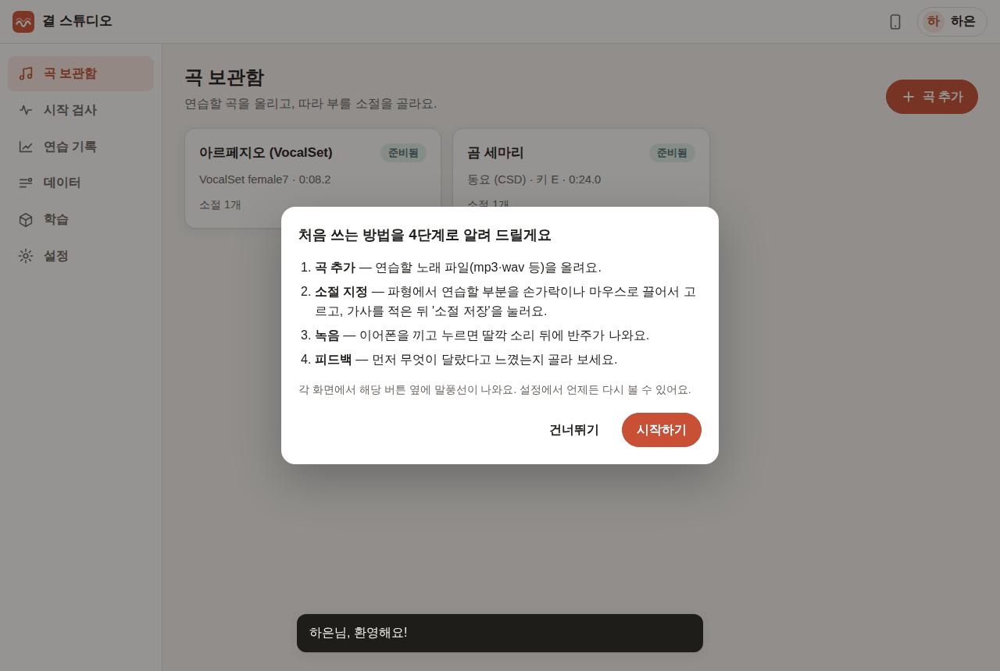 |
| ① 곡 추가 — 실제 버튼 옆에 말풍선 | 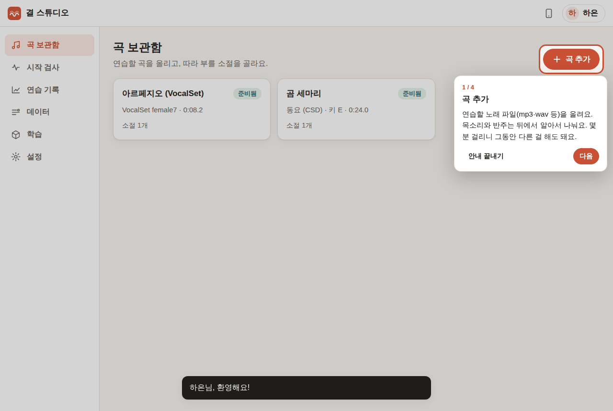 |
| ② 소절 지정 — 곡을 올리면 파형 위에서 이어져요 | 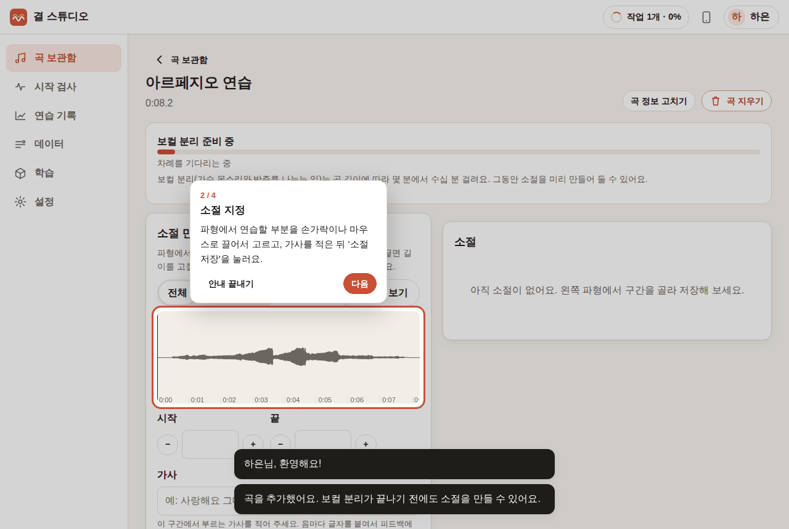 |
| ③ 녹음 | 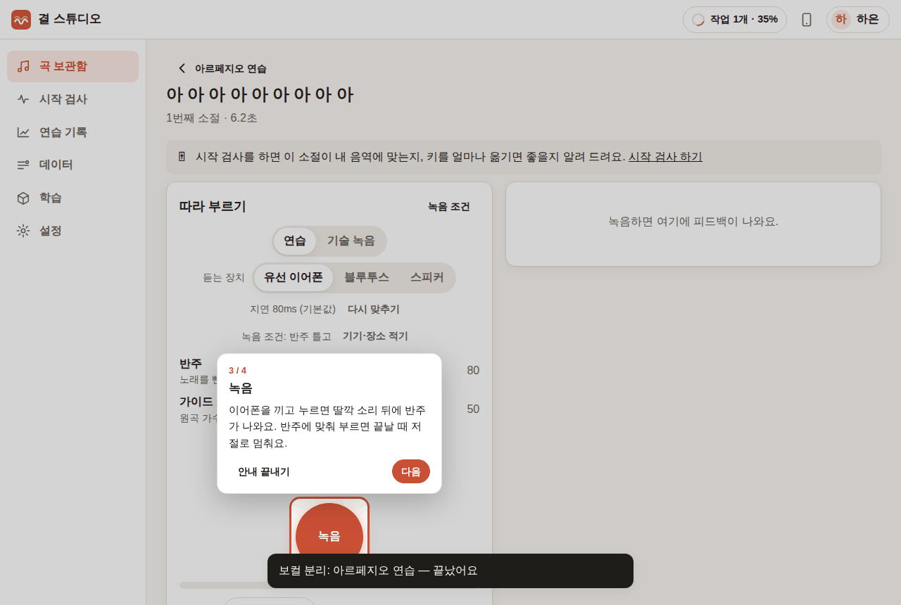 |
| ④ 피드백 — 녹음이 끝나면 피드백 카드에서 | 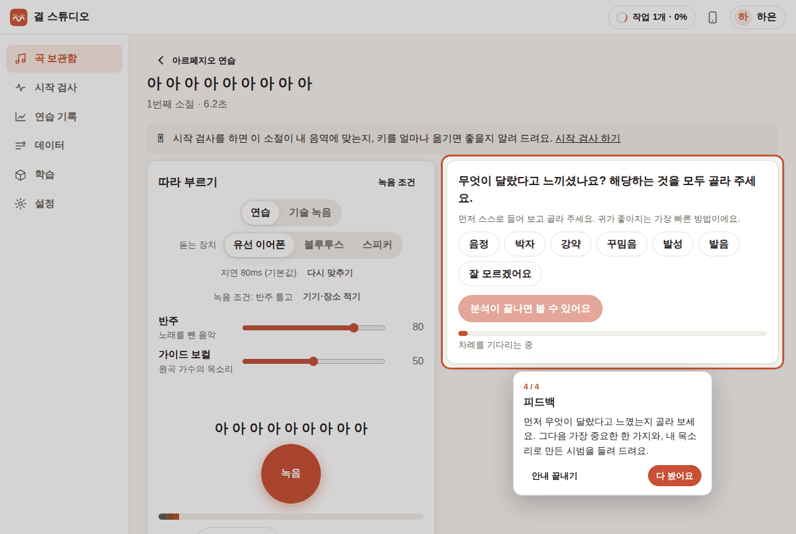 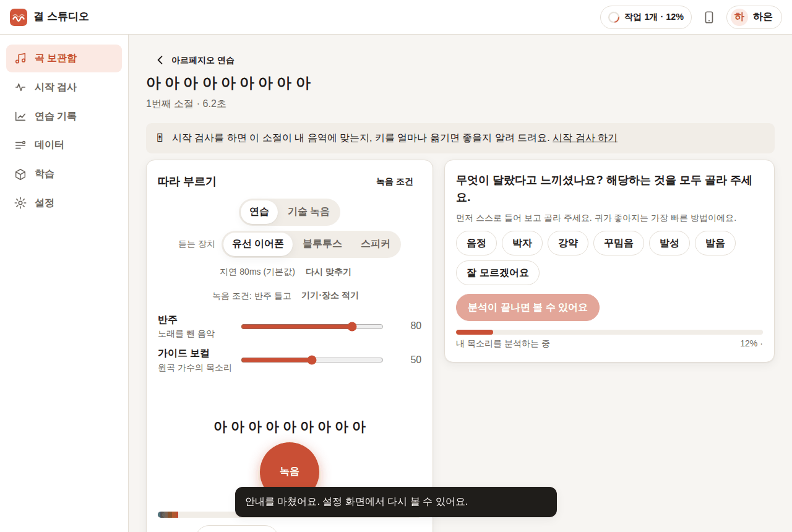 |
| 오류는 "무슨 일 + 어떻게" 한두 문장으로 | 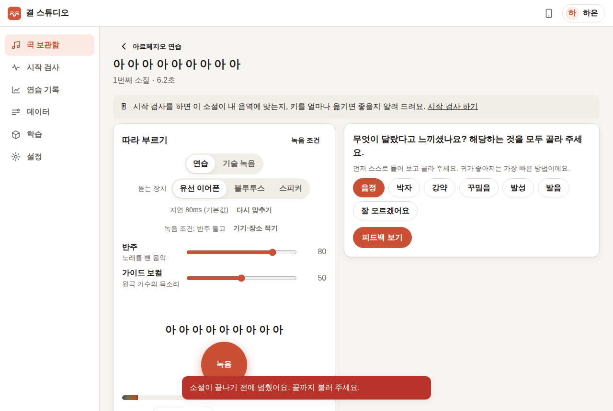 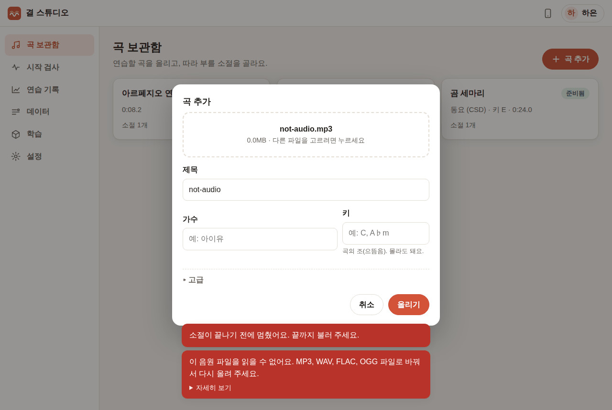 |
| 휴대폰 연결 화면: QR, 주소, 경고 넘기는 법, 인증서 설치(선택) | 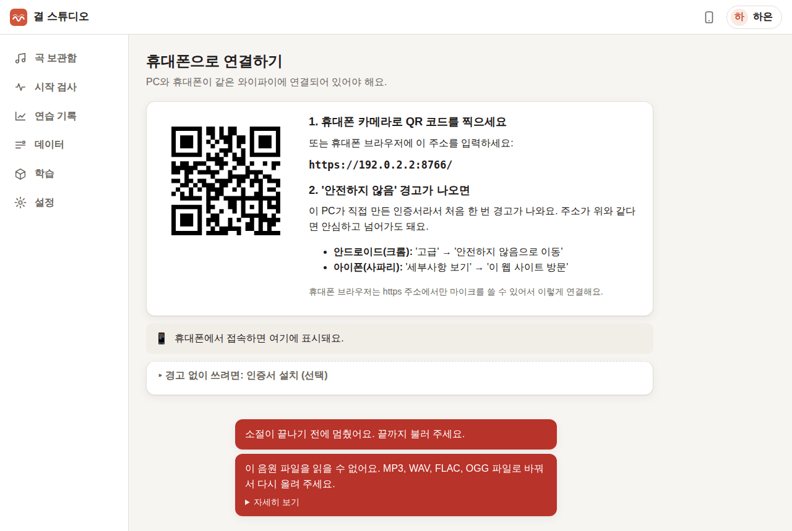 |
| 휴대폰(아이폰 사파리 화면 크기)에서 https 주소로 접속 → 사용자 고르기 → 연습 | 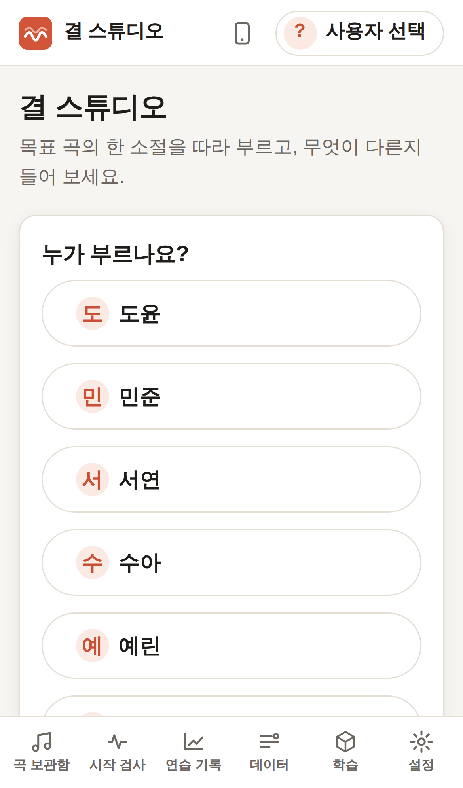 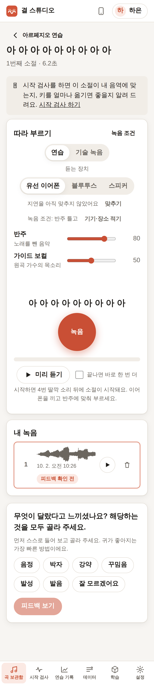 |
| 휴대폰이 접속하면 PC 화면에 "연결된 기기"로 바로 표시 |  |

## 만든 것

### 안내 투어 (`web/js/tour.js`)
- 등록 직후 "처음 쓰는 방법을 4단계로 알려 드릴게요" 창: 곡 추가 → 소절 지정 → 녹음 → 피드백을 한 줄씩 보여 주고 **시작하기 / 건너뛰기**.
- 각 단계는 **실제 화면의 그 버튼 옆 말풍선**(주변을 살짝 어둡게, 버튼 테두리 강조)으로 나옵니다. 그 버튼을 직접 쓰거나 "다음"을 누르면 다음 단계로 넘어가고, 다음 단계는 그 화면이 열릴 때 나타납니다. 이미 곡이 있어서 다른 길로 연습 화면에 왔으면 그 화면의 단계로 건너뜁니다.
- 대화창이 떠 있는 동안은 말풍선을 숨기고, 창 크기·스크롤에 맞춰 위치를 다시 잡습니다(휴대폰 폭 포함). 새로 고쳐도 진행 중인 단계에서 이어집니다. 설정 → "안내 투어 다시 보기".

### 휴대폰 접속
- **연결된 기기 표시**: 같은 와이파이의 기기가 앱에 접속하면 PC의 연결 화면에 "아이폰 · 사파리 — 방금"처럼 바로 보입니다(3초마다 갱신, 브라우저 정보로 기기 종류만 표시, 저장하지 않음). 비개발자가 "연결이 된 건지" 확인할 수 있게 했습니다.
- **주소가 여러 개인 PC**(유선+무선, VPN 등): "주소 1 / 주소 2"를 골라 QR과 인증서 QR이 함께 바뀝니다.
- 이전 단계에서 만든 것: PC가 만든 로컬 인증 기관 + 서버 인증서(LAN 주소 포함, 397일), http로 들어온 휴대폰은 https로 보내고 인증서 받기(`/ca.crt`)만 http로 허용, 경고 넘기는 법(안드로이드·아이폰), 인증서 설치법과 지문.

### 오류 문구
- 실행 파일은 콘솔 창이 없어서, **시작에 실패하면 대화창**으로 알립니다: 데이터 폴더 권한 없음 / 저장 공간 부족 / 포트 사용 중 / 그 밖(원래 오류와 `logs/app.log`를 개발팀에 보내 달라는 안내).
- 모델·데이터 출처를 한국어로: 설정·첫 실행 화면의 보컬 분리 모델 라이선스와 출처, 학습 기록의 데이터 출처("테스터가 동의하고 녹음한 소리 — 이 앱으로 직접 녹음한 데이터"). gyeol 자산 목록의 영어 원문은 그대로 함께 둡니다.
- "이 작업은 지금 멈출 수 없어요" 같은 문구에 할 일("끝날 때까지 기다려 주세요")을 붙였습니다.
- 자동 테스트가 사용자에게 보이는 API 오류 몇 가지가 한국어이고 영어 단어가 섞이지 않았는지 확인합니다.

## 실제 녹음으로 확인한 방법과 결과
Chromium에서 새 테스터("하은")로 처음부터 진행했습니다(`tests/e2e/phase5.mjs`). 노래는 4단계와 같은 VocalSet 실제 녹음입니다.

| 단계 | 확인한 것 |
|---|---|
| 등록 → 안내 | 등록 직후 4단계 안내 창, "시작하기" → 곡 보관함의 '곡 추가' 버튼에 말풍선 1/4 |
| 곡 추가 | 버튼을 누르자 다음 단계로 넘어가고, 곡을 올려 곡 화면이 열리자 파형 위에 말풍선 2/4 |
| 소절 지정 | 파형을 끌어 구간을 고르자 다음 단계로, 소절 저장 → 목표 분석 끝 |
| 녹음 | 연습 화면을 열자 녹음 버튼에 말풍선 3/4, 가상 가수(VocalSet female2)가 부르자 4/4로 |
| 피드백 | 녹음이 올라가자 "무엇이 달랐다고 느끼셨나요?" 카드에 말풍선 4/4, "다 봤어요" → "안내를 마쳤어요" |
| 오류 문구 | 딸깍 소리 도중에 멈춤 → "소절이 끝나기 전에 멈췄어요. 끝까지 불러 주세요." / 음원이 아닌 파일 → "이 음원 파일을 읽을 수 없어요. MP3, WAV, FLAC, OGG 파일로 바꿔서 다시 올려 주세요." |
| 휴대폰 | 아이폰 13 화면·사파리 브라우저 정보로 PC의 https 주소(`https://<PC 주소>:8766/`)에 접속 → 사용자 고르기 → 연습 화면 |
| PC 연결 화면 | 휴대폰이 접속하자 3초 안에 "연결된 기기 — 아이폰 · 사파리 — 방금" |

테스트 환경에서는 브라우저가 PC의 LAN 주소로 직접 TLS 연결을 열면 샌드박스 네트워크가 끊어 버려서, 휴대폰 쪽 요청만 Playwright가 같은 주소·헤더로 대신 보내도록 했습니다(서버 입장에서는 LAN의 다른 기기에서 온 요청 그대로). 같은 주소에 `curl`로 https 접속해 인증서와 응답을 따로 확인했습니다.

**자동 테스트**(`tests/test_distribution.py`): 휴대폰용 주소·QR·인증서 주소(주소 2개), 접속한 기기 표시, http → https 이동과 인증서 예외, 기기 이름, 모델 출처 한국어, API 오류 문구.

## 남은 것 (팀 확인 필요)
- 실제 휴대폰(아이폰 사파리, 안드로이드 크롬·삼성 인터넷)에서 인증서 경고 넘기기와 마이크 권한 — 이 환경에는 실제 휴대폰이 없어 Chromium의 아이폰 흉내로 확인했습니다.
- Windows·macOS 실행 파일은 GitHub Actions `build` 워크플로에서 만들고 실행 확인(smoke test)까지 합니다. 서명되지 않은 앱이라 처음 실행할 때 보안 경고가 나오고, 넘기는 법은 [설치 안내](설치-안내.md)에 있습니다.
